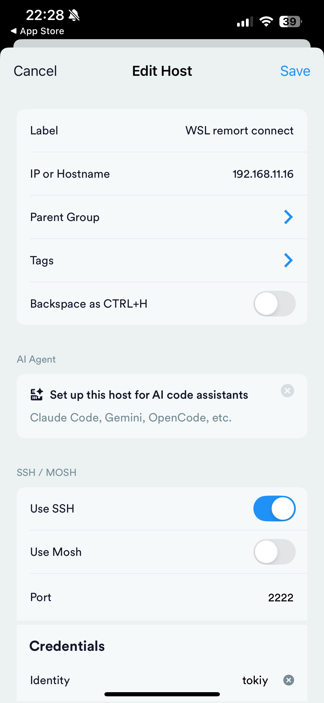
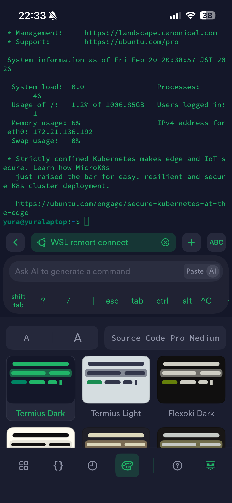
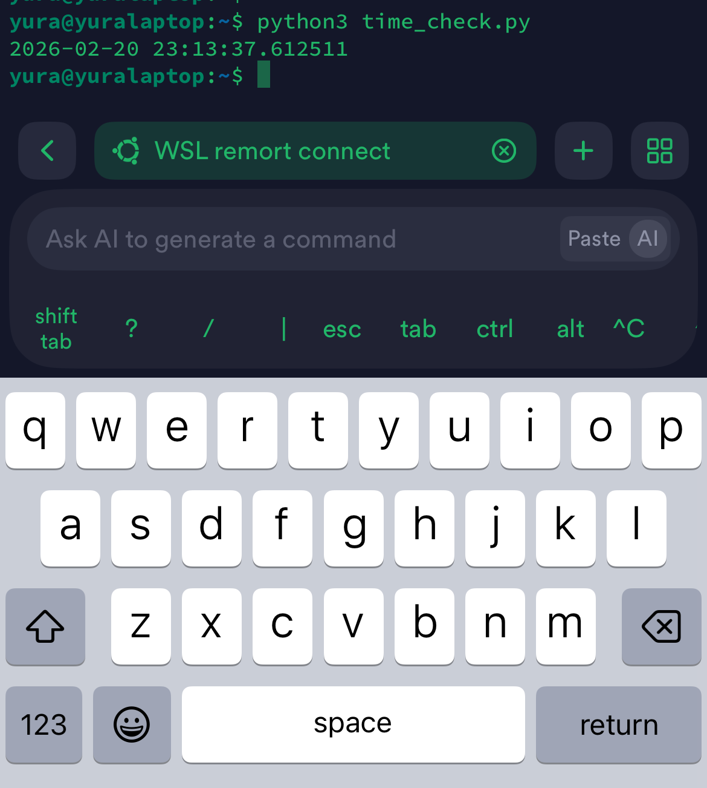
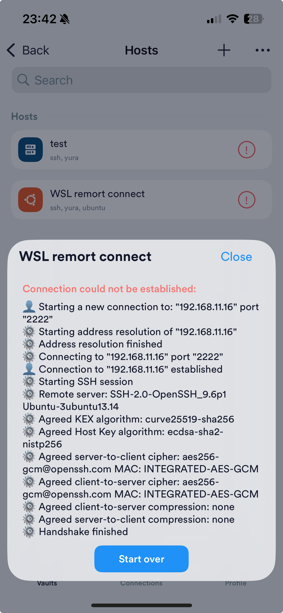
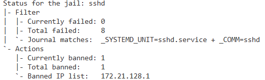

# 最終課題：発展的な環境構築を伴う遠隔操作サーバ構築手順書

## 1. 目的と完成条件の定義
本手順書は、ノートPC上のWSL(Ubuntu)をサーバとして構築し、同一ネットワーク上のスマートフォンから安全に遠隔操作を行う環境を構築することを目的とする。

**完成条件：**
* スマートフォン(iOS)から公開鍵認証を用いてのみWSLへSSH接続できること（パスワード認証の完全無効化）。
* 複数回の認証失敗に対して、fail2banが適切にIPをブロックすること。
* 接続後、コマンド一つでWSL上のプログラムが起動し、実行時の日時が取得・表示されること。

## 2. 前提条件
* **対象OS:** Ubuntu 22.04 LTS (Windows 11 WSL2 上で稼働)
* **実行環境:** ローカルVM (WSL2)
* **クライアント環境:** iOS 18.5 (アプリ: Termius を使用)
* **利用ツール・パッケージ:** `apt`, `ufw`, `fail2ban`, `python3`
* **ネットワーク条件:** ローカルネットワーク（Wi-Fi）。Windowsホスト経由のポートフォワーディングを利用。

## 3. 全体構成図とポート設計

* **通信経路:** iPhone(Termius) → [Wi-Fi] → Windows 11 (Port: 2222) → [Port Proxy] → WSL2 Ubuntu (Port: 22)
* **使用ポート:**
  * 外部待受ポート: TCP 2222 (Windows側で開放)
  * 内部サーバポート: TCP 22 (WSLのSSHデーモン)

## 4. 事前準備 (Windows側の設定)
WSL2はWindowsとは異なる仮想IPを持つため、Windows側で通信を中継する設定を行う。

**1. IPアドレスの確認**
Windowsのコマンドプロンプト、およびWSLのターミナルで以下を実行しIPを控える。
* WindowsのIP (`ipconfig` IPv4アドレス): 例 `192.168.1.10`
* WSLのIP (`ip a` eth0のinetアドレス): 例 `172.18.0.5`

**2. ポートフォワーディングとファイアウォール許可**
Windows PowerShellを**管理者権限**で実行し、以下のコマンドを入力する。

```powershell
# Windowsの2222番ポートへのアクセスをWSLの22番ポートへ転送
netsh interface portproxy add v4tov4 listenport=2222 listenaddress=0.0.0.0 connectport=22 connectaddress=[ここにwslのip]

# Windowsファイアウォールで2222番ポートの外部からの受信を許可
New-NetFirewallRule -DisplayName "WSL SSH" -Direction Inbound -Action Allow -Protocol TCP -LocalPort 2222
```

## 5. 構築手順 (WSL/Ubuntu側の設定)

### 5.1 パッケージの更新と基本設定
```bash
sudo apt update && sudo apt upgrade -y
sudo apt install openssh-server -y
sudo service ssh start
```

### 5.2 発展要素：ユーザー管理強化 (SSH公開鍵認証)
```bash
# 1. SSH鍵ペアの生成 (パスフレーズは空とする)
ssh-keygen -t ed25519 -f ~/.ssh/id_ed25519 -N ""

# 2. 公開鍵を認可リストに登録
cat ~/.ssh/id_ed25519.pub >> ~/.ssh/authorized_keys

# 3. 権限の厳格化
chmod 700 ~/.ssh
chmod 600 ~/.ssh/authorized_keys
```

### 5.3 発展要素：ハードニング (UFW と fail2ban)
```bash
sudo apt install ufw -y
sudo ufw allow 22/tcp
sudo ufw --force enable
```

```bash
sudo apt install fail2ban -y
sudo nano /etc/fail2ban/jail.local
```

**【設定ファイル完全版】 `/etc/fail2ban/jail.local`** (権限: 644)
```ini
[DEFAULT]
ignoreip = 127.0.0.1/8 ::1
bantime  = 3600
findtime  = 600
maxretry = 3

[sshd]
enabled = true
port    = ssh
filter  = sshd
logpath = /var/log/auth.log
maxretry = 3
```
```bash
sudo service fail2ban restart
```

### 5.4 SSH設定のハードニング (パスワード認証の無効化)
```bash
sudo nano /etc/ssh/sshd_config
```

**【設定ファイル完全版】 `/etc/ssh/sshd_config`** (権限: 644)
※主要な設定箇所のみ抜粋。
```text
# This is the sshd server system-wide configuration file.  See
# sshd_config(5) for more information.

# This sshd was compiled with PATH=/usr/bin:/bin:/usr/sbin:/sbin

# The strategy used for options in the default sshd_config shipped with
# OpenSSH is to specify options with their default value where
# possible, but leave them commented.  Uncommented options override the
# default value.

Include /etc/ssh/sshd_config.d/*.conf

Port 22
#AddressFamily any
ListenAddress 0.0.0.0
#ListenAddress ::

#HostKey /etc/ssh/ssh_host_rsa_key
#HostKey /etc/ssh/ssh_host_ecdsa_key
#HostKey /etc/ssh/ssh_host_ed25519_key

# Ciphers and keying
#RekeyLimit default none

# Logging
#SyslogFacility AUTH
#LogLevel INFO

# Authentication:

#LoginGraceTime 2m
PermitRootLogin no
#StrictModes yes
#MaxAuthTries 6
#MaxSessions 10

PubkeyAuthentication yes

# Expect .ssh/authorized_keys2 to be disregarded by default in future.
#AuthorizedKeysFile     .ssh/authorized_keys .ssh/authorized_keys2

#AuthorizedPrincipalsFile none

#AuthorizedKeysCommand none
#AuthorizedKeysCommandUser nobody

# For this to work you will also need host keys in /etc/ssh/ssh_known_hosts
#HostbasedAuthentication no
# Change to yes if you don't trust ~/.ssh/known_hosts for
# HostbasedAuthentication
#IgnoreUserKnownHosts no
# Don't read the user's ~/.rhosts and ~/.shosts files
#IgnoreRhosts yes

# To disable tunneled clear text passwords, change to no here!
PasswordAuthentication no
PermitEmptyPasswords no

# Change to yes to enable challenge-response passwords (beware issues with
# some PAM modules and threads)
KbdInteractiveAuthentication no

# Kerberos options
#KerberosAuthentication no
#KerberosOrLocalPasswd yes
#KerberosTicketCleanup yes
#KerberosGetAFSToken no

# GSSAPI options
#GSSAPIAuthentication no
#GSSAPICleanupCredentials yes
#GSSAPIStrictAcceptorCheck yes
#GSSAPIKeyExchange no

# Set this to 'yes' to enable PAM authentication, account processing,
# and session processing. If this is enabled, PAM authentication will
# be allowed through the KbdInteractiveAuthentication and
# PasswordAuthentication.  Depending on your PAM configuration,
# PAM authentication via KbdInteractiveAuthentication may bypass
# the setting of "PermitRootLogin without-password".
# If you just want the PAM account and session checks to run without
# PAM authentication, then enable this but set PasswordAuthentication
# and KbdInteractiveAuthentication to 'no'.
UsePAM yes

#AllowAgentForwarding yes
#AllowTcpForwarding yes
#GatewayPorts no
X11Forwarding yes
#X11DisplayOffset 10
#X11UseLocalhost yes
#PermitTTY yes
PrintMotd no
#PrintLastLog yes
#TCPKeepAlive yes
#PermitUserEnvironment no
#Compression delayed
#ClientAliveInterval 0
#ClientAliveCountMax 3
#UseDNS no
#PidFile /var/run/sshd.pid
#MaxStartups 10:30:100
#PermitTunnel no
#ChrootDirectory none
#VersionAddendum none

# no default banner path
#Banner none

# Allow client to pass locale environment variables
AcceptEnv LANG LC_*

# override default of no subsystems
Subsystem       sftp    /usr/lib/openssh/sftp-server
```
```bash
sudo service ssh restart
```

### 5.5 遠隔実行用プログラム (日時取得スクリプト) の配置
Pythonを用いて現在の日時を出力するシンプルなスクリプトを作成する。

```bash
# 実行スクリプトの作成
nano ~/time_check.py
```

**【ソースコード完全版】 `~/time_check.py`** (権限: 644)
```python
import datetime

dt_now = datetime.datetime.now()

print(dt_now)
```

### 5.6 スマートフォン (iOS 18.5) 側の接続準備
iPhoneから安全に接続するための鍵転送とアプリ設定を行う。

**1. 秘密鍵のiOSへの転送**
WSL上で以下のコマンドを実行し、Windowsのエクスプローラーを起動する。
```bash
explorer.exe ~/.ssh
```
開いたフォルダ内にある `id_ed25519`（拡張子のない秘密鍵ファイル）をコピーし、iCloud Drive等を経由してiPhoneの「ファイル」アプリに保存する。
*(※セキュリティ配慮：転送完了後、iCloud上の中間ファイルは削除すること)*

**2. Termius (iOSアプリ) の設定**
1. App Storeから **Termius** をインストールして起動する。
2. **鍵のインポート:**
   * 左下の"Vaults"を押し、画面中の `Keychain` を開く。
   * 右上の `+` ボタンをタップし、`Import Key` を選択。
   * iPhoneの「ファイル」アプリから、先ほど保存した `id_ed25519` を選択してインポートする。
3. **接続先 (Host) の作成:**
   * "Vaults"から`Hosts` 画面に戻り、右上の `+` ボタンから `New Host` を選択。
   * 以下の通り入力する。
     * **Label:** 任意の名前 (例: WSL Server)
     * **Hostname or IP Address:** WindowsのIPアドレス (例: `192.168.1.10`)
     * **Port:** `2222`
     * **Credentials(以下2項目だけ設定)**
       * **Username:** WSLのユーザー名
       * **Key:** インポートした `id_ed25519` を選択。
   * 右上の `Save` をタップして保存。

<!--  -->


## 6. 動作確認と検証

**1. 疎通確認と公開鍵認証のテスト (iOS側)**
* Termiusの `Hosts` 一覧から作成したホストをタップする。
* 初回接続時の警告が出たら `Continue` をタップ。
* パスワードを入力することなく、WSLのターミナル画面が表示されることを確認する。
<!--  -->


**2. プログラムの遠隔実行 (iOS側)**
* iPhoneのTermiusの画面で、以下のコマンドを実行する。
```bash
python3 ~/time_check.py
```
* 実行時の日時（例: `2026-02-20 23:16:05.123456`）がターミナル上に正しく出力されることを確認する。
<!--  -->


**3. セキュリティ動作確認 (fail2ban) (サーバ側)**
* 意図的に鍵の設定を外すなどしてパスワード認証を試み、数回ログインを失敗させる。
* サーバ（WSL）側で `sudo fail2ban-client status sshd` を実行し、BanされたIP（iPhoneのIPアドレス）がリストに追加されていることを確認する。



* WSL側でのログでも以下のようにiPhoneのIPがbanされている



## 7. トラブルシューティング

| 現象 | 原因 | 対処 |
| :--- | :--- | :--- |
| **iPhoneからConnection RefusedやTimeoutになる** | WindowsファイアウォールまたはIP設定 | PowerShellでファイアウォールルールを確認。`ipconfig`でIPが変わっていないか見直す。 |
| **Permission denied (publickey)** | 鍵の不一致または権限設定 | 秘密鍵が正しいか確認。サーバ側で `chmod 600 ~/.ssh/authorized_keys` を再実行。 |

## 8. セキュリティ配慮
* **パスワード認証の完全無効化:** ブルートフォース攻撃を防ぐため、`sshd_config` で `PasswordAuthentication no` とし、鍵を持つ端末からしかアクセスできない設計とした。
* **不要ポートの閉鎖:** UFWを用いてSSH（22番）以外の外部からの不要な通信を全て遮断している。

## 9. 参考資料
* [OpenSSH Server - Ubuntu Documentation](https://ubuntu.com/server/docs/service-openssh)
* [Fail2ban - Community Help Wiki](https://help.ubuntu.com/community/Fail2ban)
* [Python 3 Official Documentation](https://docs.python.org/ja/3/)

## 10. おわりに（まとめ）
本課題では、公開鍵認証やfail2banを用いたセキュアなSSHサーバ環境を構築し、動作検証としてシンプルな日時取得プログラムをスマートフォンから遠隔で実行した。

しかし、この構築された環境の真の価値は、**「あらかじめ任意のコードをWSL上に設定しておくことで、外出先からでもスマートフォン一つで安全かつ即座に任意の処理を実行できる基盤が完成した」**という点にある。


例えば、今回実行した `time_check.py` の中身を、定期的なスクレイピング処理、自宅内ネットワークのIoT機器（スマート家電やカメラ等）の制御コマンド、あるいはPCのリソースを要するバッチ処理などに書き換えるだけで、このサーバは強力なリモートコントロールハブとして機能する。発展的なセキュリティ設定によって外部からの脅威を排除しつつ、柔軟なプログラム実行を可能にする実践的なインフラ基盤を構築できた。
